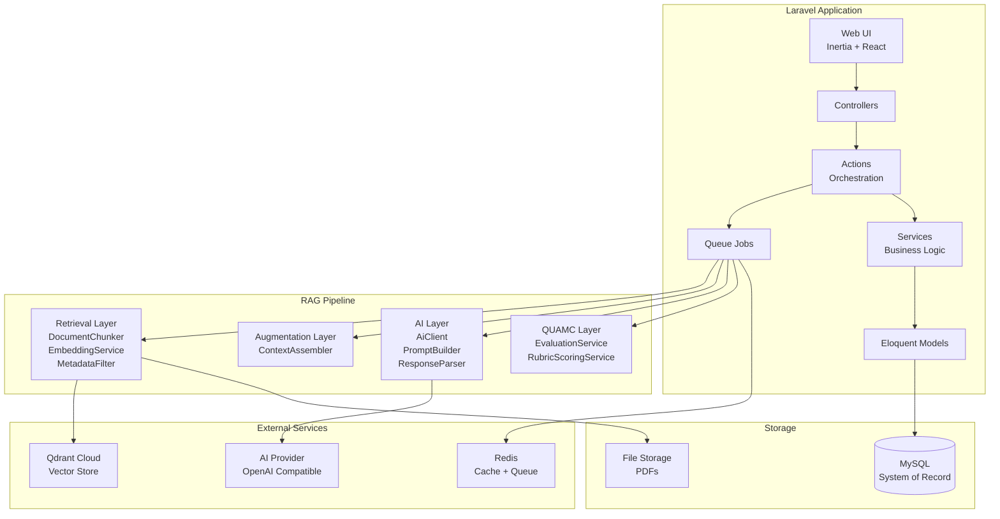
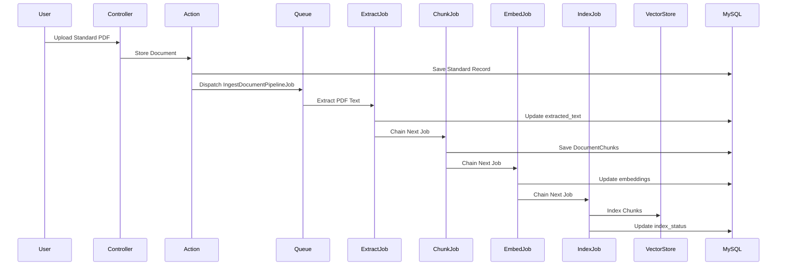
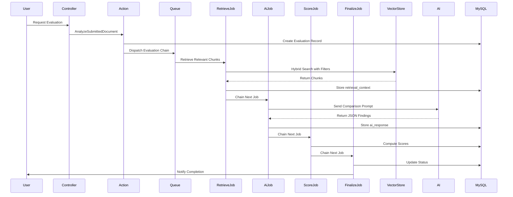
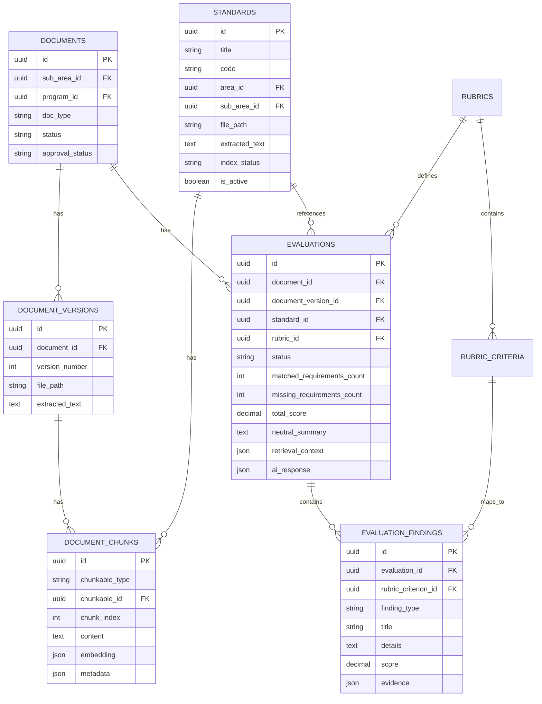

# Design Document: QUAMC AI + RAG Integration

## Overview

This design document specifies the technical architecture for integrating AI-powered Retrieval-Augmented Generation (RAG) capabilities into the existing QUAMC Laravel application. The system enables intelligent comparison between submitted documents and reference standards using vector search, semantic retrieval, and AI analysis while preserving existing workflows and maintaining clear separation of concerns.

### Design Goals

1. **Preserve Existing Workflows**: Extend without rewriting document upload, versioning, and approval processes
2. **Isolation**: Keep RAG logic contained in `app/Rag` namespace with clear boundaries
3. **Neutrality**: AI provides objective findings only; Laravel business logic computes scores
4. **Asynchronous Processing**: All expensive operations run as background jobs
5. **Flexibility**: Support multiple vector stores (Qdrant Cloud, local fallback) and AI providers
6. **Caching**: Minimize redundant API calls and expensive computations
7. **Scalability**: Handle large standard libraries with efficient metadata filtering

### System Context

The QUAMC system manages quality assurance documentation for academic accreditation. Users upload documents that must be evaluated against institutional standards. The RAG integration automates the comparison process by:

1. Extracting and indexing standard documents into a vector store
2. Retrieving relevant standard sections when evaluating submissions
3. Using AI to identify matched requirements, missing items, and unclear areas
4. Computing scores based on institutional rubrics and policies

## Architecture

### High-Level Architecture



### Layer Responsibilities


**Retrieval Layer** (`app/Rag/Retrieval`)
- Extract text from PDFs
- Chunk documents into retrievable segments
- Generate embeddings (local fallback or external provider)
- Filter by metadata (standard_id, area_id, program_id, cycle_id, version, is_active)
- Execute hybrid search (dense + sparse vectors)

**Augmentation Layer** (`app/Rag/Augmentation`)
- Assemble retrieved chunks into comparison context
- Format rubric requirements for AI consumption
- Build compact payloads to minimize token usage

**AI Layer** (`app/Rag/AI`)
- Build task-specific prompts
- Call AI provider with structured output requests
- Parse and validate JSON responses
- Provide heuristic fallback when AI unavailable

**QUAMC Layer** (`app/Rag/Quamc`)
- Apply institutional scoring rules
- Compute weighted scores from rubric criteria
- Determine pass/fail status
- Persist neutral findings and summaries

### Architectural Principles

1. **Separation of Concerns**: Each layer has a single responsibility
2. **Dependency Inversion**: Layers depend on interfaces, not concrete implementations
3. **Fail Gracefully**: System continues operating when RAG features fail
4. **Cache Aggressively**: Expensive operations are cached with appropriate TTLs
5. **Queue Everything**: No long-running operations in HTTP requests
6. **Preserve State**: MySQL remains the system of record for all business data

## Components and Interfaces

### Vector Store Interface

```php
interface VectorStoreInterface
{
    /**
     * Index document chunks with embeddings and metadata
     */
    public function index(string $collectionName, array $chunks): bool;
    
    /**
     * Search for relevant chunks using hybrid search
     */
    public function search(
        string $collectionName,
        array $queryEmbedding,
        array $filters,
        int $limit = 20
    ): array;
    
    /**
     * Delete chunks by metadata filter
     */
    public function delete(string $collectionName, array $filters): bool;
    
    /**
     * Check if vector store is available
     */
    public function healthCheck(): bool;
}
```

**Implementations:**

1. **QdrantVectorStore**: Production implementation using Qdrant Cloud
   - Collection: `quamc_standards`
   - Dense vector: 1536 dimensions, Cosine metric
   - Sparse vector: IDF enabled
   - Payload fields: standard_id, area_id, sub_area_id, doc_type, is_active, version, program_id, cycle_id

2. **LocalVectorStore**: Development fallback using in-memory or file-based storage
   - Simple cosine similarity search
   - No external dependencies
   - Suitable for testing and degraded mode

### Document Ingestion Pipeline



**Job Chain:**
1. `IngestDocumentPipelineJob` - Orchestrates the pipeline
2. `ExtractPdfTextJob` - Extracts text using PDF parser
3. `ChunkDocumentJob` - Splits text into overlapping chunks
4. `GenerateEmbeddingsJob` - Generates embeddings for each chunk
5. `IndexChunksJob` - Pushes chunks to vector store

### Evaluation Pipeline



**Job Chain:**
1. `RetrieveRelevantChunksJob` - Fetches relevant standard chunks
2. `RunAiComparisonJob` - Performs AI comparison
3. `ComputeScoreJob` - Applies rubric scoring
4. `FinalizeEvaluationJob` - Updates status and notifies user

### Metadata Filtering Strategy

Filters are applied in order of selectivity to minimize search space:

1. **is_active = true** - Only active standards
2. **standard_id** - Specific standard (if provided)
3. **version** - Current version (if versioning enabled)
4. **program_id** - Program-specific standards (if applicable)
5. **cycle_id** - Cycle-specific standards (if applicable)
6. **area_id** - Area-level filtering
7. **sub_area_id** - Sub-area-level filtering

All filters use AND logic. The system retrieves top N chunks (default 20) after filtering.

### Caching Strategy


**Cache Keys and TTLs:**

| Operation | Cache Key Pattern | TTL | Invalidation Trigger |
|-----------|------------------|-----|---------------------|
| PDF Text Extraction | `pdf:text:{hash}` | 24 hours | Document version change |
| Chunk Embeddings | `embedding:{hash}` | 24 hours | Never (content-addressed) |
| Retrieval Results | `retrieval:{query_hash}:{filters_hash}` | 1 hour | Standard version change |
| Augmentation Context | `context:{doc_version}:{standard_version}` | 1 hour | Version change |
| AI Response | `ai:{context_hash}` | 1 hour | Manual invalidation only |

**Cache Implementation:**
- Primary: Redis (when available)
- Fallback: Laravel file cache
- Cache driver configured via `CACHE_DRIVER` environment variable

## Data Models

### Database Schema

#### Extended Models

**standards table** (extended):
```sql
ALTER TABLE standards ADD COLUMN extracted_text LONGTEXT NULL;
ALTER TABLE standards ADD COLUMN extracted_at TIMESTAMP NULL;
ALTER TABLE standards ADD COLUMN index_status VARCHAR(50) DEFAULT 'pending';
ALTER TABLE standards ADD COLUMN index_error TEXT NULL;
ALTER TABLE standards ADD COLUMN metadata JSON NULL;
ALTER TABLE standards ADD COLUMN is_active BOOLEAN DEFAULT TRUE;
```

**documents table** (no changes required - already supports versioning)

#### New Tables

**document_chunks table**:
```sql
CREATE TABLE document_chunks (
    id CHAR(36) PRIMARY KEY,
    chunkable_type VARCHAR(255) NOT NULL,
    chunkable_id CHAR(36) NOT NULL,
    chunk_index INT UNSIGNED NOT NULL,
    content TEXT NOT NULL,
    token_count INT UNSIGNED NOT NULL,
    embedding JSON NULL,
    metadata JSON NULL,
    extracted_from VARCHAR(255) NULL,
    created_at TIMESTAMP DEFAULT CURRENT_TIMESTAMP,
    updated_at TIMESTAMP DEFAULT CURRENT_TIMESTAMP ON UPDATE CURRENT_TIMESTAMP,
    INDEX idx_chunkable (chunkable_type, chunkable_id),
    INDEX idx_chunk_index (chunk_index)
);
```

**evaluations table**:
```sql
CREATE TABLE evaluations (
    id CHAR(36) PRIMARY KEY,
    document_id CHAR(36) NOT NULL,
    document_version_id CHAR(36) NOT NULL,
    standard_id CHAR(36) NOT NULL,
    rubric_id CHAR(36) NULL,
    requested_by CHAR(36) NULL,
    status VARCHAR(50) DEFAULT 'pending',
    matched_requirements_count INT DEFAULT 0,
    missing_requirements_count INT DEFAULT 0,
    unclear_items_count INT DEFAULT 0,
    total_score DECIMAL(10,2) NULL,
    max_score DECIMAL(10,2) NULL,
    status_label VARCHAR(50) NULL,
    neutral_summary TEXT NULL,
    retrieval_context JSON NULL,
    ai_response JSON NULL,
    scoring_breakdown JSON NULL,
    error_message TEXT NULL,
    completed_at TIMESTAMP NULL,
    created_at TIMESTAMP DEFAULT CURRENT_TIMESTAMP,
    updated_at TIMESTAMP DEFAULT CURRENT_TIMESTAMP ON UPDATE CURRENT_TIMESTAMP,
    FOREIGN KEY (document_id) REFERENCES documents(id) ON DELETE CASCADE,
    FOREIGN KEY (document_version_id) REFERENCES document_versions(id) ON DELETE CASCADE,
    FOREIGN KEY (standard_id) REFERENCES standards(id) ON DELETE CASCADE,
    FOREIGN KEY (rubric_id) REFERENCES rubrics(id) ON DELETE SET NULL,
    FOREIGN KEY (requested_by) REFERENCES users(id) ON DELETE SET NULL,
    INDEX idx_document (document_id),
    INDEX idx_standard (standard_id),
    INDEX idx_status (status)
);
```

**evaluation_findings table**:
```sql
CREATE TABLE evaluation_findings (
    id CHAR(36) PRIMARY KEY,
    evaluation_id CHAR(36) NOT NULL,
    rubric_criterion_id CHAR(36) NULL,
    finding_type VARCHAR(50) NOT NULL,
    requirement_key VARCHAR(255) NULL,
    title VARCHAR(500) NOT NULL,
    details TEXT NULL,
    score DECIMAL(10,2) NULL,
    sort_order INT DEFAULT 0,
    evidence JSON NULL,
    metadata JSON NULL,
    created_at TIMESTAMP DEFAULT CURRENT_TIMESTAMP,
    updated_at TIMESTAMP DEFAULT CURRENT_TIMESTAMP ON UPDATE CURRENT_TIMESTAMP,
    FOREIGN KEY (evaluation_id) REFERENCES evaluations(id) ON DELETE CASCADE,
    FOREIGN KEY (rubric_criterion_id) REFERENCES rubric_criteria(id) ON DELETE SET NULL,
    INDEX idx_evaluation (evaluation_id),
    INDEX idx_type (finding_type)
);
```

### Model Relationships



### Eloquent Model Definitions

**Standard Model** (extended):
```php
class Standard extends Model
{
    protected $fillable = [
        'title', 'code', 'description', 'area_id', 'sub_area_id',
        'doc_type', 'rubric_id', 'uploaded_by', 'file_path',
        'original_filename', 'mime_type', 'extracted_text',
        'extracted_at', 'index_status', 'index_error', 'metadata',
        'is_active'
    ];
    
    protected $casts = [
        'metadata' => 'array',
        'is_active' => 'boolean',
        'extracted_at' => 'datetime',
    ];
    
    public function chunks(): MorphMany
    {
        return $this->morphMany(DocumentChunk::class, 'chunkable');
    }
}
```

**DocumentChunk Model**:
```php
class DocumentChunk extends Model
{
    protected $fillable = [
        'chunkable_type', 'chunkable_id', 'chunk_index',
        'content', 'token_count', 'embedding', 'metadata',
        'extracted_from'
    ];
    
    protected $casts = [
        'embedding' => 'array',
        'metadata' => 'array',
    ];
    
    public function chunkable(): MorphTo
    {
        return $this->morphTo();
    }
}
```

**Evaluation Model**:
```php
class Evaluation extends Model
{
    protected $fillable = [
        'document_id', 'document_version_id', 'standard_id',
        'rubric_id', 'requested_by', 'status',
        'matched_requirements_count', 'missing_requirements_count',
        'unclear_items_count', 'total_score', 'max_score',
        'status_label', 'neutral_summary', 'retrieval_context',
        'ai_response', 'scoring_breakdown', 'error_message',
        'completed_at'
    ];
    
    protected $casts = [
        'retrieval_context' => 'array',
        'ai_response' => 'array',
        'scoring_breakdown' => 'array',
        'completed_at' => 'datetime',
        'total_score' => 'decimal:2',
        'max_score' => 'decimal:2',
    ];
    
    public function findings(): HasMany
    {
        return $this->hasMany(EvaluationFinding::class)
            ->orderBy('sort_order');
    }
}
```

**EvaluationFinding Model**:
```php
class EvaluationFinding extends Model
{
    protected $fillable = [
        'evaluation_id', 'rubric_criterion_id', 'finding_type',
        'requirement_key', 'title', 'details', 'score',
        'sort_order', 'evidence', 'metadata'
    ];
    
    protected $casts = [
        'evidence' => 'array',
        'metadata' => 'array',
        'score' => 'decimal:2',
    ];
}
```

## Service Layer Design

### EvaluationService

**Responsibilities:**
- Create evaluation records
- Coordinate evaluation workflow
- Update evaluation status
- Retrieve evaluation history

**Key Methods:**
```php
class EvaluationService
{
    public function create(
        Document $document,
        Standard $standard,
        ?User $requestedBy = null
    ): Evaluation;
    
    public function updateStatus(
        Evaluation $evaluation,
        string $status,
        ?string $errorMessage = null
    ): void;
    
    public function storeRetrievalContext(
        Evaluation $evaluation,
        array $chunks
    ): void;
    
    public function storeAiResponse(
        Evaluation $evaluation,
        array $response
    ): void;
}
```

### RubricScoringService

**Responsibilities:**
- Apply rubric criteria to findings
- Compute weighted scores
- Determine pass/fail status
- Generate scoring breakdown

**Key Methods:**
```php
class RubricScoringService
{
    public function computeScore(
        Evaluation $evaluation,
        array $findings
    ): array;
    
    public function determineStatus(
        float $totalScore,
        float $maxScore,
        Rubric $rubric
    ): string;
    
    public function mapFindingsToCriteria(
        array $findings,
        Rubric $rubric
    ): array;
}
```

### DocumentChunker

**Responsibilities:**
- Split text into overlapping chunks
- Maintain context across chunk boundaries
- Handle long paragraphs
- Generate chunk metadata

**Configuration:**
- Chunk size: 1200 characters (configurable)
- Overlap: 200 characters (configurable)
- Minimum chunk size: 300 characters

**Algorithm:**
1. Split text by paragraph boundaries
2. Accumulate paragraphs until chunk size reached
3. Apply overlap from previous chunk
4. Handle long paragraphs by splitting at sentence boundaries
5. Attach metadata to each chunk

### EmbeddingService

**Responsibilities:**
- Generate embeddings for text chunks
- Support multiple embedding providers
- Provide local fallback
- Cache embeddings

**Providers:**
- OpenAI-compatible API (production)
- Local sparse vectors (fallback)

### MetadataFilter

**Responsibilities:**
- Build Qdrant filter expressions
- Validate filter parameters
- Optimize filter order for performance

**Filter Builder:**
```php
class MetadataFilter
{
    public function build(array $criteria): array
    {
        $filters = ['must' => []];
        
        if (isset($criteria['is_active'])) {
            $filters['must'][] = [
                'key' => 'is_active',
                'match' => ['value' => true]
            ];
        }
        
        if (isset($criteria['standard_id'])) {
            $filters['must'][] = [
                'key' => 'standard_id',
                'match' => ['value' => $criteria['standard_id']]
            ];
        }
        
        // Additional filters...
        
        return $filters;
    }
}
```

## AI Integration

### Prompt Design

**Comparison Prompt Structure:**
```
System: You are a neutral document comparison assistant. Compare the submitted document against the provided standard requirements. Return only objective findings in JSON format.

User:
Standard Requirements:
{requirements_list}

Submitted Document Excerpt:
{document_excerpt}

Retrieved Standard Context:
{retrieved_chunks}

Return JSON with:
- matched_requirements: array of requirements found in the document
- missing_requirements: array of requirements not clearly addressed
- unclear_items: array of ambiguous or partially addressed items
- extracted_sections: array of relevant document sections
- neutral_summary: brief objective summary
```

**Constraints:**
- No pass/fail judgments
- No scoring or grading language
- No institutional policy decisions
- JSON-only responses
- Temperature: 0.1 (deterministic)

### Response Validation

**Required Fields:**
- `matched_requirements` (array)
- `missing_requirements` (array)
- `unclear_items` (array)
- `extracted_sections` (array)
- `neutral_summary` (string)

**Validation Rules:**
- Each requirement must have: `requirement_key`, `title`, `details`, `evidence`
- Evidence must be array of strings
- Summary must be non-empty string
- All arrays must be valid JSON arrays

### Fallback Strategy

When AI provider unavailable:
1. Use heuristic comparison based on keyword matching
2. Generate basic findings structure
3. Mark evaluation with `ai_fallback: true` flag
4. Log warning for administrator review

## Error Handling

### Error Categories


**1. PDF Extraction Failures**
- Corrupted PDF files
- Password-protected PDFs
- Unsupported PDF versions
- **Handling**: Log error, mark document as failed, notify user

**2. Embedding Generation Failures**
- API rate limits
- Network timeouts
- Invalid API keys
- **Handling**: Retry 3 times with exponential backoff, fall back to local embeddings

**3. Vector Store Failures**
- Qdrant unavailable
- Collection not found
- Index operation timeout
- **Handling**: Fall back to LocalVectorStore, log warning, queue for retry

**4. AI Provider Failures**
- API unavailable
- Invalid response format
- Token limit exceeded
- **Handling**: Retry 3 times, fall back to heuristic comparison, mark evaluation

**5. Scoring Failures**
- Missing rubric criteria
- Invalid finding structure
- **Handling**: Use default scoring, log warning, allow manual review

### Retry Strategy

```php
// Job retry configuration
public $tries = 3;
public $backoff = [10, 30, 60]; // seconds
public $timeout = 300; // 5 minutes
```

### Error Logging

All errors logged with context:
- Job class and ID
- Input parameters
- Error message and stack trace
- Retry attempt number
- Timestamp

### User Notifications

Users notified via existing notification system:
- Evaluation completed successfully
- Evaluation failed (with reason)
- Evaluation using fallback methods

## Testing Strategy

This feature involves infrastructure integration (Qdrant Cloud, AI providers), configuration validation, and side-effect operations (PDF extraction, API calls, database writes). Property-based testing is not appropriate for this type of system.

### Unit Testing

**Focus Areas:**
- DocumentChunker: chunk size, overlap, boundary handling
- MetadataFilter: filter building, validation
- PromptBuilder: prompt formatting, context assembly
- ResponseParser: JSON parsing, validation
- RubricScoringService: score computation, status determination

**Example Tests:**
```php
// DocumentChunker
test('chunks text with proper overlap')
test('handles empty text gracefully')
test('splits long paragraphs correctly')
test('preserves metadata in chunks')

// MetadataFilter
test('builds filter with single criterion')
test('builds filter with multiple criteria')
test('validates filter parameters')

// RubricScoringService
test('computes weighted score correctly')
test('determines pass status at threshold')
test('determines fail status below threshold')
test('handles missing criteria gracefully')
```

### Integration Testing

**Focus Areas:**
- Vector store connectivity (Qdrant and local)
- AI provider integration
- Job chain execution
- Cache operations
- Database transactions

**Example Tests:**
```php
// Vector Store
test('indexes chunks to Qdrant successfully')
test('retrieves chunks with metadata filters')
test('falls back to local store when Qdrant unavailable')

// AI Integration
test('sends comparison request and receives valid JSON')
test('falls back to heuristic when AI unavailable')
test('retries on transient failures')

// Job Chains
test('ingestion pipeline completes successfully')
test('evaluation pipeline completes successfully')
test('pipeline handles failures gracefully')
```

### Feature Testing

**End-to-End Scenarios:**
```php
test('standard PDF upload triggers ingestion pipeline')
test('document evaluation creates evaluation record')
test('evaluation results display in UI')
test('re-evaluation uses cached results when versions unchanged')
test('evaluation updates when standard version changes')
```

### Mock Strategy

**External Services:**
- Mock Qdrant API responses for unit tests
- Mock AI provider responses for unit tests
- Use real services for integration tests in CI/CD
- Use local fallbacks for development

**Test Doubles:**
```php
// Mock Qdrant responses
Http::fake([
    'qdrant.example.com/*' => Http::response([
        'result' => [
            ['id' => 1, 'score' => 0.95, 'payload' => [...]],
        ]
    ])
]);

// Mock AI responses
Http::fake([
    'api.openai.com/*' => Http::response([
        'choices' => [[
            'message' => [
                'content' => json_encode([
                    'matched_requirements' => [...],
                    'missing_requirements' => [...],
                ])
            ]
        ]]
    ])
]);
```

### Performance Testing

**Benchmarks:**
- PDF extraction: < 5 seconds for 50-page document
- Chunking: < 1 second for 10,000 words
- Embedding generation: < 2 seconds per chunk (with caching)
- Vector search: < 500ms for filtered query
- Full evaluation: < 30 seconds end-to-end

**Load Testing:**
- 100 concurrent document uploads
- 50 concurrent evaluations
- 10,000+ indexed standards
- Cache hit rate > 80%

## Configuration

### Environment Variables

```bash
# Vector Store Configuration
VECTOR_STORE_DRIVER=qdrant  # qdrant | local
QDRANT_URL=https://your-cluster.qdrant.io
QDRANT_API_KEY=your-api-key
QDRANT_COLLECTION=quamc_standards

# AI Provider Configuration
AI_DRIVER=openai_compatible  # openai_compatible | heuristic
AI_BASE_URL=https://api.openai.com/v1
AI_API_KEY=your-api-key
AI_MODEL=gpt-4o-mini
AI_TIMEOUT=60

# Retrieval Configuration
RETRIEVAL_CHUNK_SIZE=1200
RETRIEVAL_CHUNK_OVERLAP=200
RETRIEVAL_TOP_K=20
RETRIEVAL_EMBEDDING_DIMENSIONS=1536

# Cache Configuration
CACHE_DRIVER=redis  # redis | file
REDIS_HOST=127.0.0.1
REDIS_PORT=6379
REDIS_PASSWORD=null

# Queue Configuration
QUEUE_CONNECTION=redis  # redis | database | sync
```

### Configuration Files

**config/vector_store.php**:
```php
return [
    'driver' => env('VECTOR_STORE_DRIVER', 'local'),
    
    'qdrant' => [
        'url' => env('QDRANT_URL'),
        'api_key' => env('QDRANT_API_KEY'),
        'collection' => env('QDRANT_COLLECTION', 'quamc_standards'),
        'timeout' => env('QDRANT_TIMEOUT', 30),
    ],
    
    'local' => [
        'storage_path' => storage_path('vector_store'),
    ],
];
```

**config/ai.php**:
```php
return [
    'driver' => env('AI_DRIVER', 'heuristic'),
    
    'openai_compatible' => [
        'base_url' => env('AI_BASE_URL'),
        'api_key' => env('AI_API_KEY'),
        'chat_endpoint' => '/chat/completions',
    ],
    
    'comparison_model' => env('AI_MODEL', 'gpt-4o-mini'),
    'timeout' => env('AI_TIMEOUT', 60),
];
```

**config/retrieval.php**:
```php
return [
    'chunk_size' => env('RETRIEVAL_CHUNK_SIZE', 1200),
    'chunk_overlap' => env('RETRIEVAL_CHUNK_OVERLAP', 200),
    'top_k' => env('RETRIEVAL_TOP_K', 20),
    'embedding_dimensions' => env('RETRIEVAL_EMBEDDING_DIMENSIONS', 1536),
    
    'cache_ttl' => [
        'extraction' => 86400,  // 24 hours
        'embeddings' => 86400,  // 24 hours
        'retrieval' => 3600,    // 1 hour
        'context' => 3600,      // 1 hour
    ],
];
```

### Health Checks

**Endpoint**: `GET /api/health/rag`

**Response**:
```json
{
    "status": "healthy",
    "checks": {
        "vector_store": {
            "status": "up",
            "driver": "qdrant",
            "latency_ms": 45
        },
        "ai_provider": {
            "status": "up",
            "driver": "openai_compatible",
            "latency_ms": 120
        },
        "cache": {
            "status": "up",
            "driver": "redis",
            "hit_rate": 0.85
        },
        "queue": {
            "status": "up",
            "pending_jobs": 12,
            "failed_jobs": 0
        }
    }
}
```

## Deployment Considerations

### Production Checklist

- [ ] Qdrant Cloud cluster provisioned and accessible
- [ ] Collection `quamc_standards` created with correct schema
- [ ] AI provider API key configured and validated
- [ ] Redis instance running and accessible
- [ ] Queue workers running with appropriate concurrency
- [ ] Environment variables set in production
- [ ] Database migrations executed
- [ ] Health check endpoint accessible
- [ ] Monitoring and alerting configured
- [ ] Backup strategy for MySQL data
- [ ] Log aggregation configured

### Scaling Considerations

**Horizontal Scaling:**
- Queue workers can scale independently
- Multiple web servers share Redis cache
- Qdrant Cloud handles vector store scaling

**Vertical Scaling:**
- Increase queue worker memory for large PDFs
- Increase Redis memory for cache hit rate
- Increase database connections for concurrent evaluations

**Performance Optimization:**
- Enable Redis persistence for cache durability
- Use database connection pooling
- Implement rate limiting for AI API calls
- Monitor and optimize slow queries

### Monitoring Metrics

**Application Metrics:**
- Evaluation completion rate
- Average evaluation duration
- Cache hit rate by operation type
- Job failure rate by job type
- AI API response time
- Vector store query latency

**Business Metrics:**
- Documents evaluated per day
- Standards indexed
- Average score by program/area
- Evaluation re-run frequency

### Security Considerations

**API Keys:**
- Store in environment variables, never in code
- Rotate regularly
- Use separate keys for staging/production

**Data Privacy:**
- Document content stored in MySQL (encrypted at rest)
- Vector embeddings do not contain raw text
- AI provider requests include minimal context
- Evaluation results access controlled by existing policies

**Network Security:**
- Qdrant API calls over HTTPS
- AI provider API calls over HTTPS
- Redis connections secured with password
- Database connections over SSL in production

## Migration Path

### Phase 1: Infrastructure Setup
1. Provision Qdrant Cloud cluster
2. Create collection with schema
3. Configure environment variables
4. Deploy database migrations

### Phase 2: Standard Indexing
1. Run ingestion pipeline for existing standards
2. Verify chunks indexed correctly
3. Test retrieval with sample queries
4. Monitor indexing performance

### Phase 3: Evaluation Integration
1. Enable evaluation feature for pilot users
2. Monitor evaluation results
3. Gather user feedback
4. Tune retrieval and scoring parameters

### Phase 4: Full Rollout
1. Enable for all users
2. Monitor system performance
3. Optimize based on usage patterns
4. Document operational procedures

## Future Enhancements

### Planned Features
- Multi-language support for international standards
- Section-aware chunking for structured documents
- Citation tracking for evidence traceability
- Batch evaluation for multiple documents
- Custom rubric templates
- Evaluation comparison across cycles

### Technical Improvements
- Implement semantic caching for similar queries
- Add support for additional vector stores (Pinecone, Weaviate)
- Implement streaming responses for large evaluations
- Add support for additional AI providers (Anthropic, Cohere)
- Implement fine-tuned models for domain-specific comparison

## Appendix

### Glossary

- **Chunk**: A segment of text extracted from a document, typically 1200 characters
- **Dense Vector**: High-dimensional embedding representing semantic meaning (1536 dimensions)
- **Sparse Vector**: Keyword-based vector with IDF weighting
- **Hybrid Search**: Combination of dense and sparse vector search
- **Metadata Filter**: Pre-search filtering based on document attributes
- **Neutral Finding**: Objective observation without pass/fail judgment
- **Rubric**: Scoring framework with weighted criteria
- **Evaluation**: Complete analysis of a document against a standard

### References

- [Qdrant Documentation](https://qdrant.tech/documentation/)
- [OpenAI API Reference](https://platform.openai.com/docs/api-reference)
- [Laravel Queue Documentation](https://laravel.com/docs/queues)
- [Laravel Cache Documentation](https://laravel.com/docs/cache)

### API Contracts

**Qdrant Index Request**:
```json
{
    "points": [
        {
            "id": "uuid",
            "vector": {
                "dense": [0.1, 0.2, ...],
                "sparse": {
                    "indices": [1, 5, 10],
                    "values": [0.5, 0.3, 0.2]
                }
            },
            "payload": {
                "standard_id": "uuid",
                "area_id": "uuid",
                "sub_area_id": "uuid",
                "doc_type": "standard",
                "is_active": true,
                "version": "1.0",
                "program_id": "uuid",
                "cycle_id": "uuid",
                "content": "chunk text"
            }
        }
    ]
}
```

**Qdrant Search Request**:
```json
{
    "vector": {
        "name": "dense",
        "vector": [0.1, 0.2, ...]
    },
    "filter": {
        "must": [
            {"key": "is_active", "match": {"value": true}},
            {"key": "standard_id", "match": {"value": "uuid"}}
        ]
    },
    "limit": 20,
    "with_payload": true
}
```

**AI Comparison Response**:
```json
{
    "matched_requirements": [
        {
            "requirement_key": "1.1",
            "title": "Program Mission",
            "details": "Document clearly states program mission",
            "evidence": ["Section 2 paragraph 1", "Appendix A"]
        }
    ],
    "missing_requirements": [
        {
            "requirement_key": "1.2",
            "title": "Learning Outcomes",
            "details": "Learning outcomes not explicitly listed",
            "evidence": []
        }
    ],
    "unclear_items": [
        {
            "requirement_key": "1.3",
            "title": "Assessment Methods",
            "details": "Assessment methods mentioned but not detailed",
            "evidence": ["Section 4 paragraph 2"]
        }
    ],
    "extracted_sections": [
        "Section 2: Program Overview...",
        "Section 4: Assessment Framework..."
    ],
    "neutral_summary": "The document addresses 8 of 10 requirements with clear evidence. Two requirements need additional supporting documentation."
}
```

---

**Document Version**: 1.0  
**Last Updated**: 2024  
**Status**: Complete
